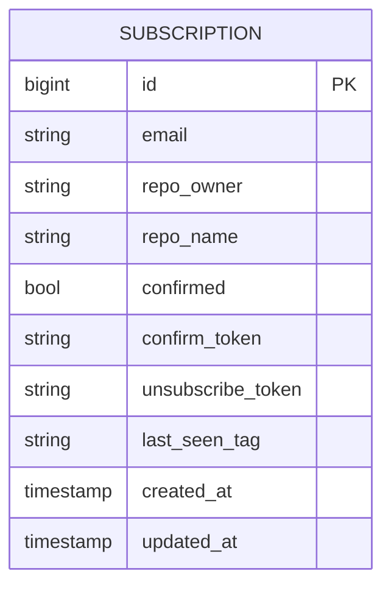

**Date:** 2026-05-06

# Database Schema

The system uses a single table `subscriptions` to manage state.

## Migration Notes

Database migrations are automatically applied on application startup via internal/migrations.
The confirm_token and unsubscribe_token are 64-character hex strings generated for security.
