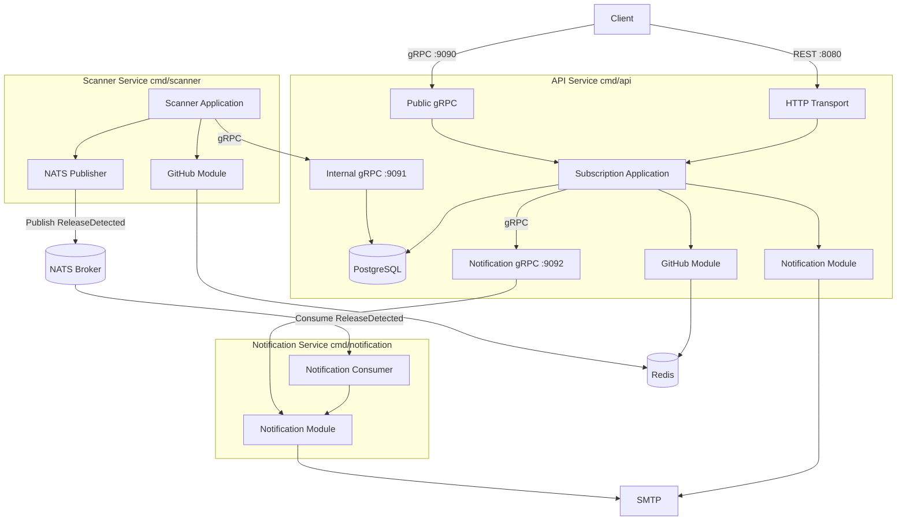
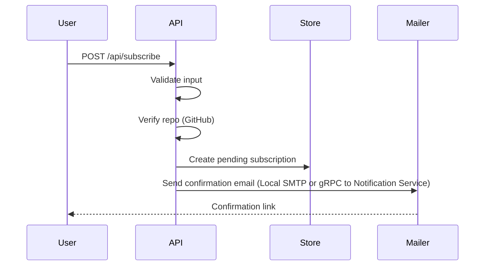
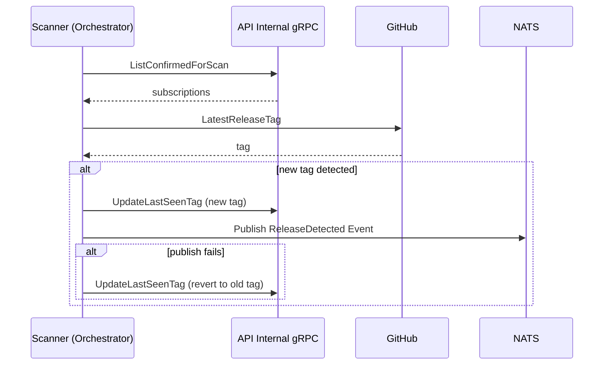
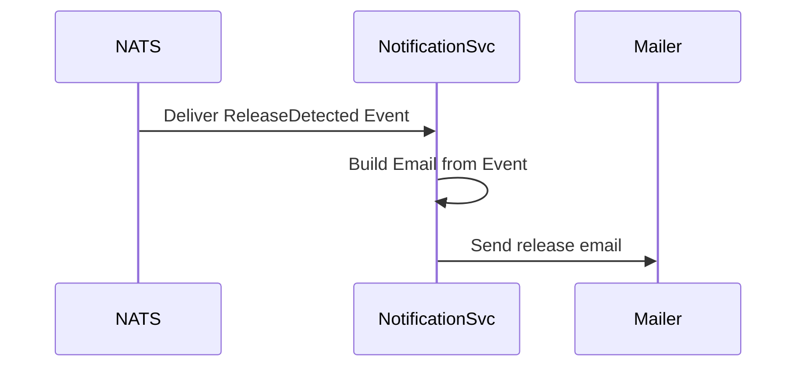

# System Architecture

**Date:** 2026-06-20

## Overview

The GitHub Release Notification system is a modular Go application split into an **API service**, a **Scanner microservice**, and a **Notification service**. The API handles subscription lifecycle and exposes REST and gRPC interfaces. The Scanner polls GitHub for new releases and publishes events to NATS, while the Notification service consumes these events and handles email delivery.

## Assumptions

- **Deployment Environment:** Containerized (Docker/Docker Compose) with persistent PostgreSQL storage.
- **GitHub API Usage:** `GITHUB_TOKEN` has sufficient rate-limit quotas for subscribed repositories and scan interval.
- **SMTP Availability:** SMTP server is reachable and configured for the environment.
- **Single-Tenant Scale:** One scanner instance is sufficient for moderate load; multiple scanner replicas would require coordination (e.g., distributed job queue).
- **Data Integrity:** Database is backed up externally; schema migrations run on API startup.
- **Identity:** Email is the subscription identifier; API key protects all programmatic endpoints.

## Requirements

### Functional Requirements

- **Subscription Management:** Subscribe, confirm, unsubscribe, list subscriptions.
- **Confirmation Flow:** Pending subscriptions confirmed via email token.
- **Release Tracking:** Scanner service checks for new GitHub releases on an interval.
- **Email Notifications:** Confirmation and release emails via SMTP.
- **Queryability:** REST and public gRPC for subscription queries.

### Non-Functional Requirements

- **Reliability:** Scanner handles GitHub/SMTP failures without crashing.
- **Scalability:** Redis caches GitHub responses to reduce rate-limit pressure.
- **Security:** API key on REST, public gRPC, internal gRPC, and metrics.
- **Observability:** Prometheus metrics on API; scanner exposes process metrics.
- **Maintainability:** Domain modules with explicit boundaries (see ADR 0004).

## Domain Boundaries

| Domain | Owner | Responsibility |
|--------|-------|----------------|
| Subscription | API service | Lifecycle, PostgreSQL persistence |
| Release Scanner | Scanner service | Polling, publishing `ReleaseDetected` events, `last_seen_tag` updates via gRPC |
| GitHub Integration | Shared module | Repo validation, release tags, Redis cache |
| Notification | Notification service / API | Email templates and SMTP delivery (confirmations via API or gRPC to Notification service, release updates via Notification service) |
| Platform | Shared | Config, migrations, metrics, errors |

## Component Diagram

## Subscription Flow

## Scanner Flow (Saga)

## Notification Flow

## Technology Choices

- **Persistence:** PostgreSQL (API service only)
- **Caching:** Redis for GitHub API responses
- **Message Broker:** NATS for async event delivery
- **Communication:** REST + public gRPC (clients); internal gRPC (scanner ↔ API); NATS event streaming (scanner ↔ notification service)
- **Observability:** Prometheus metrics

## Related ADRs

- [ADR 0001](adr/0001-architecture-pattern.md) — Original Clean Architecture (evolved by ADR 0004)
- [ADR 0002](adr/0002-async-scanner-design.md) — Scanner design (now separate service)
- [ADR 0003](adr/0003-dual-api-rest-and-grpc.md) — Dual REST/gRPC API
- [ADR 0004](adr/0004-modular-architecture-and-scanner-microservice.md) — Modular architecture and scanner extraction
- [ADR 0005](adr/0005-nats-message-broker-and-notification-service.md) — NATS message broker and Notification service
- [ADR 0006](adr/0006-orchestrated-saga-for-release-notification.md) — Orchestrated Saga for release notifications
- [ADR 0007](adr/0007-grpc-mail-verification.md) — gRPC Mail Verification Service
