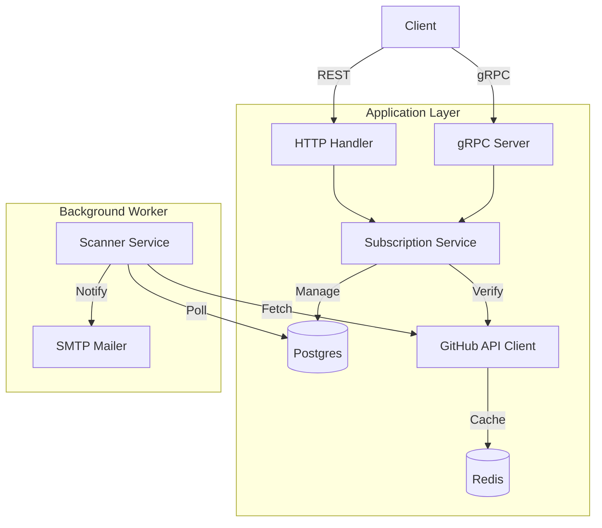
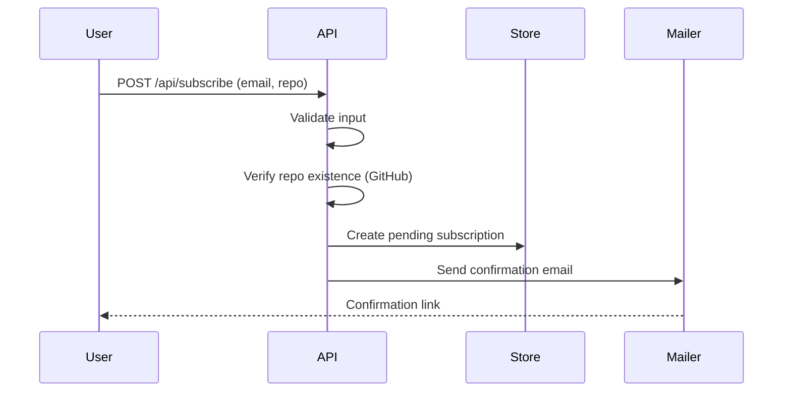

# System Architecture

**Date:** 2026-05-06

## Overview
The GitHub Release Notification API is a Go-based service that tracks repository releases. It utilizes a layered architecture to separate transport (REST/gRPC) from business logic and data persistence.

## Assumptions
- **Deployment Environment:** The service is intended to be run within a containerized environment (Docker/Docker Compose) with access to persistent volume storage for the database.
- **GitHub API Usage:** It is assumed that the provided GITHUB_TOKEN has sufficient rate-limit quotas for the number of subscribed repositories and the chosen SCAN_INTERVAL.
- **SMTP Availability:** The system assumes an SMTP server is reachable and configured correctly for the environment.
- **Single-Tenant Scale:** The current design assumes a moderate load where a single background scanner instance is sufficient. If repository counts scale significantly, horizontal scaling of the scanner may require a distributed job queue (e.g., Temporal or RabbitMQ).
- **Data Integrity:** It is assumed that the database is backed up externally; the application manages schema migrations automatically on startup but does not perform full database dumps.
- **Identity:** The system relies on email addresses as the unique identifier for subscriptions; there is no formal user account management or password-protected authentication system beyond the API Key.

## Requirements
### Functional Requirements
- **Subscription Management:** Users can subscribe to GitHub repository releases by providing an email and repository name (owner/repo).
- **Confirmation Flow:** Subscriptions are created in a pending state and must be confirmed via a unique token sent via email.
- **Unsubscription:** Users can stop receiving notifications using a secure token provided in the notification emails.
- **Release Tracking:** The system performs periodic background scans to check for new releases in subscribed repositories.
- **Email Notifications:** Users receive an automated email notification when a new tag is detected in a tracked repository.
- **Queryability:** Users can list their active subscriptions via both REST API and gRPC.

### Non-Functional Requirements
- **Reliability:** Background scanning must handle API failures and transient errors gracefully without crashing the service.
- **Scalability (GitHub API):** The system must respect GitHub's rate limits by utilizing Redis-based caching for repository checks.
- **Performance:**
  - API response times should be minimal, with heavy operations (like release polling) offloaded to background workers.
  - Database queries should be indexed for high-frequency lookup operations.
- **Security:**
  - All API endpoints must be protected by an X-API-Key to prevent unauthorized usage.
  - Sensitive communication tokens (confirm/unsubscribe) must be randomly generated and sufficiently complex.
- **Observability:** The system must expose Prometheus metrics to monitor HTTP performance, scanner health, and notification success/failure rates.
- **Maintainability:** The codebase must follow Clean Architecture patterns to allow for swapping storage or notification backends with minimal impact to core logic.

## Component Diagram

## Subscription Flow

## Technology Choices
- **Persistence:** PostgreSQL for durable storage of subscription state.
- **Caching:** Redis to prevent GitHub API rate-limiting.
- **Communication**: Dual-interface (REST for web UI, gRPC for programmatic access).
- **Observability:** Prometheus metrics tracking HTTP performance and GitHub integration health.
