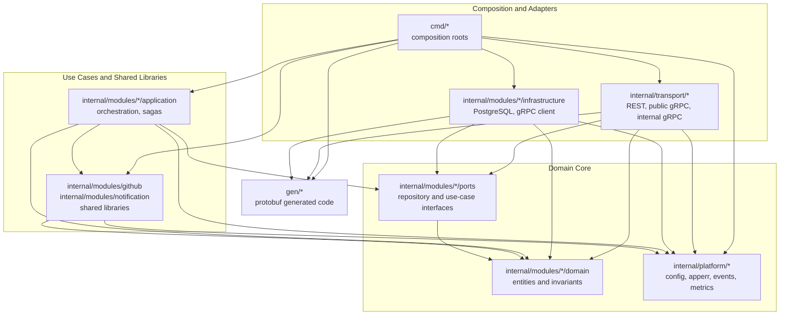
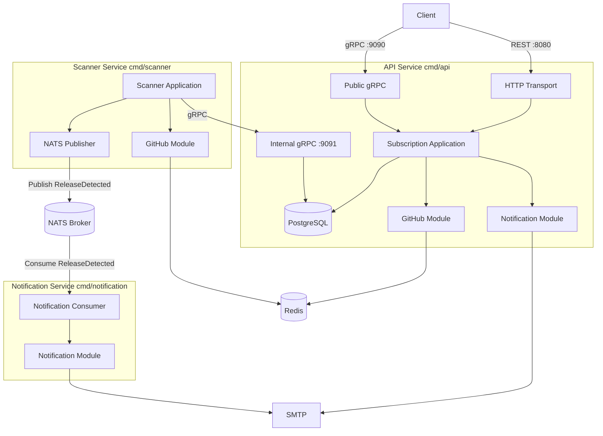
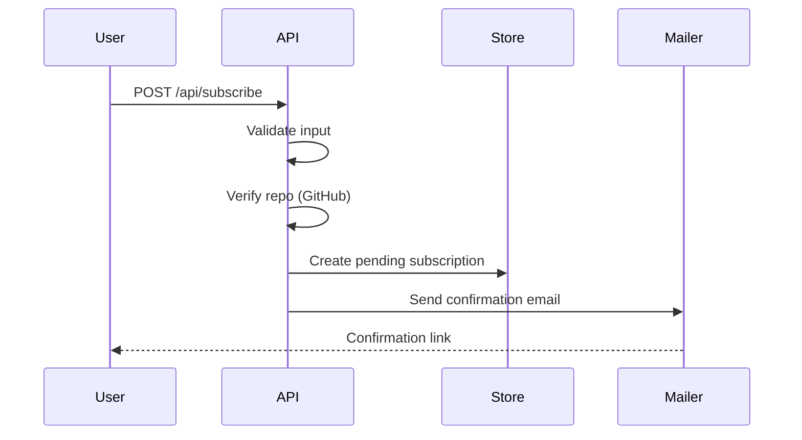
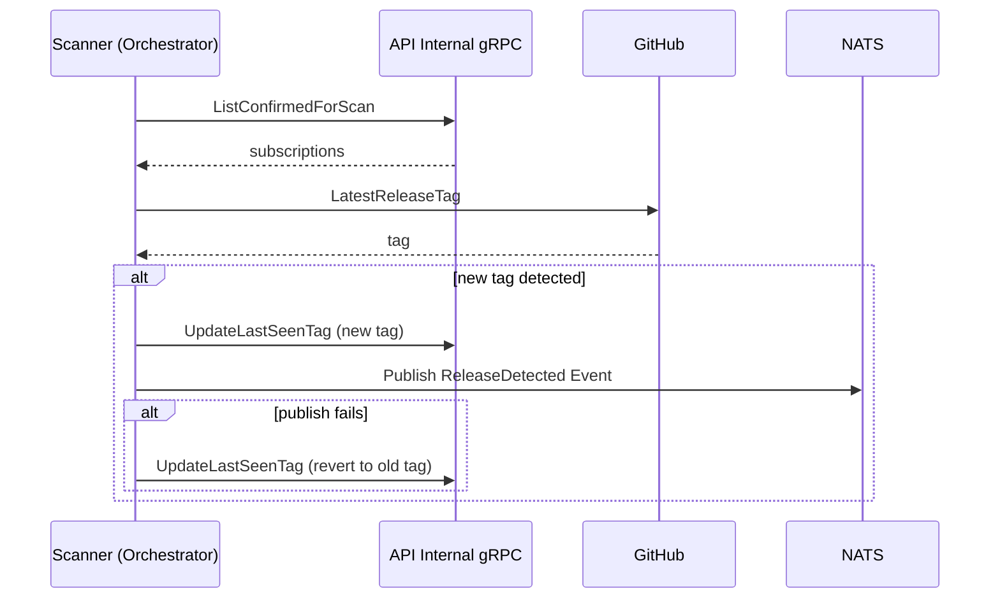
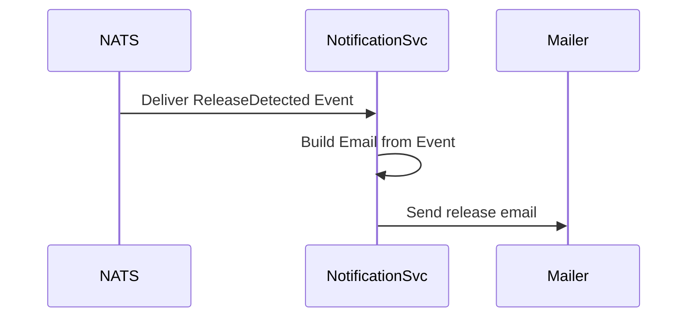

# System Architecture

**Date:** 2026-07-05

## Overview

The GitHub Release Notification system is a modular Go application split into an **API service**, a **Scanner microservice**, and a **Notification service**. The API handles subscription lifecycle and exposes REST and gRPC interfaces. The Scanner polls GitHub for new releases and publishes events to NATS, while the Notification service consumes these events and handles email delivery.

Each deployable service is a thin **composition root** (`cmd/*`) that wires transport adapters, application services, and infrastructure implementations. Domain logic lives in bounded-context modules under `internal/modules/*`, with explicit layer boundaries enforced by architectural tests (see [Layer Architecture](#layer-architecture)).

## Assumptions

- **Deployment Environment:** Containerized (Docker/Docker Compose) with persistent PostgreSQL storage.
- **GitHub API Usage:** `GITHUB_TOKEN` has sufficient rate-limit quotas for subscribed repositories and scan interval.
- **SMTP Availability:** SMTP server is reachable and configured for the environment.
- **Single-Tenant Scale:** One scanner instance is sufficient for moderate load; multiple scanner replicas would require coordination (e.g., distributed job queue).
- **Data Integrity:** Database is backed up externally; schema migrations run on API startup.
- **Identity:** Email is the subscription identifier; API key protects all programmatic endpoints.

## Requirements

### Functional Requirements

- **Subscription Management:** Subscribe, confirm, unsubscribe, list subscriptions.
- **Confirmation Flow:** Pending subscriptions confirmed via email token.
- **Release Tracking:** Scanner service checks for new GitHub releases on an interval.
- **Email Notifications:** Confirmation and release emails via SMTP.
- **Queryability:** REST and public gRPC for subscription queries.

### Non-Functional Requirements

- **Reliability:** Scanner handles GitHub/SMTP failures without crashing.
- **Scalability:** Redis caches GitHub responses to reduce rate-limit pressure.
- **Security:** API key on REST, public gRPC, internal gRPC, and metrics.
- **Observability:** Prometheus metrics on API; scanner exposes process metrics.
- **Maintainability:** Domain modules with explicit boundaries (see ADR 0004).

## Domain Boundaries

| Domain | Owner | Responsibility |
|--------|-------|----------------|
| Subscription | API service | Lifecycle, PostgreSQL persistence |
| Release Scanner | Scanner service | Polling, publishing `ReleaseDetected` events, `last_seen_tag` updates via gRPC |
| GitHub Integration | Shared module | Repo validation, release tags, Redis cache |
| Notification | Notification service / API | Email templates and SMTP delivery (confirmations via API, release updates via Notification service) |
| Platform | Shared | Config, migrations, metrics, errors |

## Layer Architecture

Within each bounded context, code is organized into **Clean Architecture layers**. Dependencies point inward: outer layers may depend on inner layers, never the reverse.

### Layer Diagram



### Directory-to-Layer Mapping

| Layer | Path pattern | Responsibility |
|-------|--------------|----------------|
| **Domain** | `internal/modules/*/domain` | Entities, value objects, domain rules. No imports from other application packages. |
| **Ports** | `internal/modules/*/ports` | Repository and use-case interfaces consumed by transport and application layers. |
| **Application** | `internal/modules/*/application` | Use-case orchestration (subscribe flow, scanner loop, release saga). |
| **Infrastructure** | `internal/modules/*/infrastructure` | Outbound adapters: PostgreSQL store, gRPC client to API internal API. |
| **Shared modules** | `internal/modules/github`, `internal/modules/notification` | Cross-cutting capabilities reused by multiple services. |
| **Platform** | `internal/platform/*` | Cross-cutting utilities: configuration, migrations, metrics, errors, NATS publisher, event schema. |
| **Transport** | `internal/transport/*` | Inbound adapters: HTTP handlers, gRPC servers. Depend on `ports`, not concrete application types. |
| **Composition** | `cmd/api`, `cmd/scanner`, `cmd/notification` | Wire dependencies and start processes. Only layer allowed to touch every other layer. |
| **Generated** | `gen/*` | Protobuf/gRPC stubs. Used by transport and infrastructure at boundaries. |

### Dependency Rules

| From layer | May import |
|------------|------------|
| Domain | Standard library only |
| Ports | Domain |
| Application | Domain, ports, platform, shared modules |
| Infrastructure | Domain, ports, platform, generated code |
| Shared modules | Platform; `notification` may also import `subscription/domain` for email content |
| Platform | Standard library; `platform/config` may import `notification` for `SMTPConfig` typing |
| Transport | Domain, ports, platform, generated code |
| Composition (`cmd/*`) | All layers above |

**Explicit prohibitions:**

- Domain must not import any `releasesapi/*` package.
- Application must not import infrastructure or transport (inversion of control via interfaces in `ports`).
- Transport must not import application or infrastructure implementations.
- Platform packages (except `config`) must not import domain modules.

These rules are enforced automatically by `tests/architecture/layers_test.go`. Run them with:

```bash
go test ./tests/architecture/...
```

### Module Layout by Service

| Service | Layers used |
|---------|-------------|
| **API** (`cmd/api`) | `transport/http`, `transport/grpc/public`, `transport/grpc/internalapi`, `subscription/application`, `subscription/infrastructure`, `github`, `notification`, `platform/*` |
| **Scanner** (`cmd/scanner`) | `scanner/application`, `scanner/infrastructure`, `github`, `platform/config`, `platform/metrics`, `platform/nats`, `platform/events` |
| **Notification** (`cmd/notification`) | `notification` (consumer + SMTP), `platform/config`, `platform/events` |

Cross-service integration uses **contracts at the edges** only:

- Scanner ↔ API: internal gRPC (`gen/internalv1`, ADR 0004)
- Scanner ↔ Notification: NATS event on `releases.detected` (`platform/events`, ADR 0005)

## Component Diagram



## Subscription Flow



## Scanner Flow (Saga)



## Notification Flow



## Technology Choices

- **Persistence:** PostgreSQL (API service only)
- **Caching:** Redis for GitHub API responses
- **Message Broker:** NATS for async event delivery
- **Communication:** REST + public gRPC (clients); internal gRPC (scanner ↔ API); NATS event streaming (scanner ↔ notification service)
- **Observability:** Prometheus metrics

## Related ADRs

- [ADR 0001](adr/0001-architecture-pattern.md) — Original Clean Architecture (evolved by ADR 0004)
- [ADR 0002](adr/0002-async-scanner-design.md) — Scanner design (now separate service)
- [ADR 0003](adr/0003-dual-api-rest-and-grpc.md) — Dual REST/gRPC API
- [ADR 0004](adr/0004-modular-architecture-and-scanner-microservice.md) — Modular architecture and scanner extraction
- [ADR 0005](adr/0005-nats-message-broker-and-notification-service.md) — NATS message broker and Notification service
- [ADR 0006](adr/0006-orchestrated-saga-for-release-notification.md) — Orchestrated Saga for release notifications

## Further Reading

- [Testing Guide](TESTING.md) — unit, integration, E2E, and architecture tests
